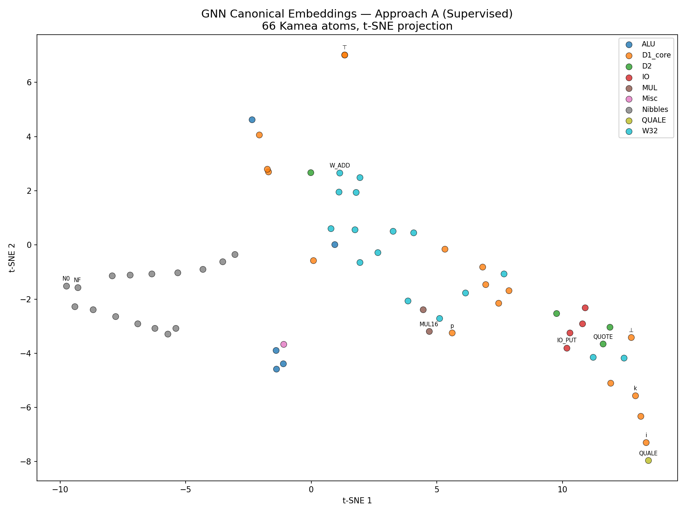

<p align="center">
  
</p>

# Kamea

**A minimal self-modeling framework for relational description, with machine-checked proofs in Lean 4.**

<p align="center"><sub>In loving memory of Boba</sub></p>

---

## Three Theorems, Five Extensions, a Machine-Checked 66-Atom Proof, and a OISC Hardware Emulator

This repository contains Lean 4 formalizations of six results about finite algebraic structures that model themselves — including the full 66-atom Kamea algebra with machine-checked behavioral separability — plus a Python implementation with a full 74181 ALU, 32-bit wide arithmetic, 16-bit multiply, byte-level IO, and a QUALE symmetry-breaker — all uniquely recoverable from a scrambled Cayley ROM by a dedicated hardware scanner.

All Lean proofs compile with **zero `sorry`** on Lean 4.28.0 / Mathlib v4.28.0.

**Theorem 1 (Existence).** Intrinsically reflexive Distinction Structures exist. A 16-element symmetric algebra (Δ₀) and a 17-element directed algebra (Δ₁) each satisfy axioms A1--A7', Ext, and contain behavioral self-models: internal encodings whose elements, when composed by the structure's own operation, reproduce the behavior of the structure's own components.

**Theorem 2 (Discoverability).** Discoverably reflexive Distinction Structures exist. The 17-element directed model Δ₁ has a self-model that is recoverable from black-box probing alone, with each of the 8 recovery steps proved unique. An observer with no prior knowledge can identify every structural component purely from the operation table.

**Theorem 3 (Irreducibility).** Actuality is not determined by structure. Two models (Δ₁ and Δ₁') on the same 18-element carrier share 322 out of 324 operation table entries, both satisfy all axioms and reflexivity conditions, yet differ in actuality assignment. No structural predicate resolves the difference. The only way to determine which elements are actual is to query the actuality tester directly.

**Extension 1 (Δ₂ -- Flat Quoting).** Δ₁ extended with QUOTE, EVAL, APP, UNAPP restricted to flat (one-level) evaluation. The carrier is finite, the operation is total, and all properties are proved by `decide`. This is the Datalog-level extension: naming without executing, inspecting without reducing.

**Extension 2 (Δ₃ -- Recursive Evaluation).** Δ₂ extended with recursive EVAL via a fuel-bounded interpreter. Evaluating a quoted application node recursively evaluates both subterms, then applies the results. Proved in Lean using a combined eval/dot function structurally recursive on fuel. Concrete computations (flat eval, nested eval, triple nesting, QUOTE/EVAL roundtrips) verified by `native_decide`.

**Extension 3 (74181 ALU + IO).** Δ₂ extended with 26 new atoms: 16 nibble data values (N0–NF), 3 ALU dispatch atoms, 2 ALU predicates, 1 nibble successor (N_SUCC), and 4 IO atoms (IO_PUT, IO_GET, IO_RDY, IO_SEQ). Total: 47 atoms.

**Extension 4 (W32 + MUL).** 18 additional atoms for 32-bit wide arithmetic (W_ADD, W_SUB, W_CMP, W_XOR, W_AND, W_OR, W_NOT, W_SHL, W_SHR, W_ROTL, W_ROTR, W_PACK8, W_LO, W_HI, W_MERGE, W_NIB) and 16-bit multiply (MUL16, MAC16). Total: 65 atoms.

**Extension 5 (QUALE).** A single symmetry-breaking atom that makes the algebra *rigid*. The 26 opaque atoms (D2 + IO + W32 + MUL) all have identical all-p Cayley rows; QUALE gives each a unique structurally-identifiable target in its column. All 66 atoms are now uniquely identifiable from the Cayley table alone — no term-level probing required.

**Result 6 (Full Kamea -- Machine-Checked).** The complete 66-atom Kamea algebra is formalized in Lean 4 with all 66 uniqueness theorems, a DirectedDS instance (A2, A5, Ext), an intrinsic reflexivity witness, nibble Z/16Z group properties (closure, commutativity, associativity, inverses), ALU correctness theorems, and QUALE structural properties. The behavioral separability theorem (`kamea_Ext`) proves that every pair of distinct atoms is distinguishable from the Cayley table alone — the gap between "demonstrated" and "proved" is closed.

Seven machine-checked results, plus a computationally complete extension with hardware emulator. Self-description is possible. Communication is possible. Computation is possible. But the question of what's real cannot be settled by structure alone.

---

## Why It Matters

**The algebra is the computer.** The Kamea is a single finite Cayley table — one binary operation `dot` on 66 elements — that encodes a complete computational system: combinators, booleans, encoders, testers, a 74181 ALU (32 operations via 3 mode atoms x 16 selectors), byte-level IO, 32-bit wide arithmetic, 16-bit multiply, quoting, and recursive evaluation. Random magmas are just tables. This table runs programs.

**Every element's identity is grounded in the algebra's own structure.** The 17-element self-model Δ₁ is not merely a naming scheme — its elements *behave* as the components they represent, under the same operation that defines everything else. Absorbers absorb. Testers test. Encoders encode. The recovery procedure that identifies them is not a heuristic; each of its 8 steps is a uniqueness lemma, machine-checked over the finite domain. Self-representation, behavioral fidelity, and black-box recoverability — all three verified in Lean with zero `sorry`.

**Actuality is irreducible.** The framework also shows what structure *cannot* do. Two models on the same 18-element carrier share 322 of 324 operation table entries, both satisfy all axioms and reflexivity conditions, yet differ in actuality assignment. No structural predicate resolves the difference. The actuality tester carries irreducible information: there is no structural back door. This is "existence is not a predicate" as a machine-checked theorem.

**QUALE is meaningful symmetry-breaking.** As the algebra grows to 66 atoms, 26 become structurally indistinguishable (identical Cayley rows), creating an S₂₆ automorphism group. Any injective column would break this symmetry — assign 26 random targets and you get rigidity. But the Kamea's QUALE column is not random. W_XOR maps to its 74181 function code. IO_PUT maps to the actuality marker. QUOTE maps to k. Each mapping encodes *why that atom is what it is*. The column doesn't just break symmetry — it carries the algebra's interpretation of its own parts. That is a semantic property, not a structural one, and no generic discriminator can measure it.

**The path from algebra to computation.** Δ₂ adds data representation (quoting without executing), Δ₃ adds recursive evaluation (executing quoted terms). Both are machine-verified. The boundary between finite decidable algebra and recursive interpretation is precisely located. The Kamea extensions (74181 ALU, W32, MUL, IO) then show that this algebraic foundation scales to practical computation — all through the same `dot` operation.

**Natural keys vs. surrogate keys.** Database designers know this distinction well. A *natural key* carries its own meaning: an ISBN encodes the publisher, the book, and a check digit. You can look at the key and know what it refers to. Scramble your database and the ISBNs still mean what they mean, because the meaning is in the structure of the key itself. A *surrogate key* is an auto-incrementing integer. Row 48823. Could be anything. The number tells you nothing. The meaning exists only in the foreign key relationships and the application layer that interprets them. Scramble the IDs and everything breaks — nothing in the number 48823 tells you it was supposed to point to a customer record.

```
Natural key:    meaning is intrinsic    (ISBN, chemical formula, absorber property)
Surrogate key:  meaning is assigned     (auto_increment, UUID, opcode 0x90)
```

**The entire conventional computing stack is surrogate keys all the way down.** Opcodes are surrogate keys into the microcode ROM. Virtual addresses are surrogate keys into page tables. File descriptors are surrogate keys into the kernel's open file table. PIDs, stack offsets, register numbers — every layer strips meaning and replaces it with an arbitrary index that only the next layer can interpret. This is Von Neumann's design: arbitrary encodings buy flexibility, and abstraction layers (ISA, microcode, OS, compiler) manage the gap between encoding and intent, with humans maintaining the correspondence at each boundary.

It works phenomenally well. But it means every layer trusts the layer below on faith. And it means a single bit flip in the wrong place is catastrophic — you've corrupted a surrogate key, and the system below can't detect the corruption because the key never carried meaning. Any integer is a valid surrogate key. There's no check digit. No structural constraint. No way to say "this key doesn't look right," because every key looks like every other key. Flip one bit in an x86 instruction decoder and the machine is bricked. Permanently. It can't know anything is wrong, because nothing in the number 0x90 tells you it should mean NOP rather than ADD or HALT. That's on page 547 of the manual, which exists outside the machine.

**The Kamea is natural keys all the way down.** `p` isn't element 0 by convention. It's the unique element satisfying `dot(p, x) = p` for all `x`. That's a structural property you can check. If someone corrupts p's row in the Cayley table, the corruption is detectable — the row no longer has the absorber property. The key carries its own validation. QUALE extends this to the opaque atoms. Before QUALE, the 26 extension atoms were like surrogate keys — their positions in the table were arbitrary, interchangeable. QUALE gives each one a natural key: QUOTE is the atom whose QUALE column entry is k, not because someone assigned that mapping, but because QUOTE and k both preserve structure, and the algebra encodes that correspondence.

Biology works the same way. DNA codons aren't arbitrary — the mapping from codon to amino acid is mediated by tRNA molecules whose physical shape *is* the mapping. Corrupt a codon and the ribosome produces the wrong protein, but the cell can often detect this through protein folding: a misfolded protein doesn't fit its structural role. Conventional computers have no analog. The wrong opcode executes the wrong operation and nobody knows until something visibly fails — which might be never, or might be after the corrupted data has propagated through seventeen systems.

The Kamea's real contribution isn't performance or recovery speed. It's demonstrating that you can build a complete computer on natural keys — where the meaning is in the structure — and prove the whole thing correct. Not because it's more efficient. It's probably less efficient for any single task. But because it gives the machine something that every living system has and no conventional computer has ever had: the ability to know what its own parts are and verify they're working correctly, from the inside, without consulting an external authority.

---

## What Recovery Doesn't Tell You

The self-model was designed in. The 17 elements of Δ₁ were chosen to make recovery work. The QUALE column was hand-crafted to break the S₂₆ symmetry. A natural question: is self-modeling *necessary* for efficient scramble-resilience? The answer is no — and working through why clarifies what the Kamea actually achieves.

**Almost all rigid magmas are efficiently recoverable.** A random magma on n elements has trivial automorphism group with probability approaching 1 as n grows. Most of these rigid magmas have no absorber, no identity, no non-trivial sub-magma, no recognizable structure at all.

An empirical census (`rigid_census.py`) confirms this quantitatively. Sampling 100,000 random magmas at each order and checking for rigidity and structural features:

| n | Rigid | Structureless rigid | Has non-trivial sub | Has absorber | Has identity |
|---|-------|--------------------|--------------------|-------------|-------------|
| 3 (exhaustive) | 98.7% | 37.5% | 50.7% | 10.4% | 10.4% |
| 4 | 100.0% | 51.8% | 45.8% | 1.5% | 1.6% |
| 5 | 100.0% | 65.6% | 34.1% | 0.2% | 0.2% |
| 6 | 100.0% | 76.4% | 23.6% | <0.1% | <0.1% |
| 7 | 100.0% | 83.9% | 16.1% | <0.1% | <0.1% |
| 8 | 100.0% | 88.3% | 11.7% | 0% | <0.1% |

"Structureless rigid" means rigid, all rows distinct, yet no absorber, no identity, and no non-trivial sub-magma. By n = 8, **88% of random magmas are structureless rigid** — they have trivial automorphism group and are therefore model-theoretically recoverable, but offer no algebraic landmarks whatsoever. The fraction grows monotonically and appears to approach 1. Meanwhile, absorbers and identities (the features Δ₁ exploits for recovery) are vanishingly rare. The Kamea's self-modeling sub-algebra is not something you stumble into; it is a carefully engineered exception to the generic case.

**The key distinction: definability vs. algorithmic recoverability.** A rigid magma guarantees that each element has *some* first-order formula that picks it out. But those formulas may require quantifier depth proportional to n, making recovery equivalent to brute-force search through Sym(n). The self-model turns this exponential problem into a polynomial one. The 8-step Δ₁ recovery is a sequence of O(n²) table scans, each narrowing the search space. The self-model provides *landmarks* — elements with unique, cheaply-testable algebraic signatures — that guide the search.

**However, efficient recovery does not require self-modeling.** A Weisfeiler-Leman (WL-1) color refinement test (`counterexample_search.py`) shows that structureless rigid magmas are almost universally recoverable in polynomial time — without any landmarks at all:

| n | Structureless rigid | WL-1 discriminated (poly-time recoverable) | WL-1 failure |
|---|--------------------|--------------------------------------------|-------------|
| 3 (exhaustive) | 7,284 | 6,822 (93.7%) | 6.3% |
| 4 | 51,836 | 51,377 (99.1%) | 0.9% |
| 5 | 65,573 | 65,567 (100.0%) | 0.009% |
| 6 | 76,413 | 76,412 (100.0%) | 0.001% |
| 7 | 83,862 | 83,862 (100.0%) | 0% |
| 8 | 88,288 | 88,288 (100.0%) | 0% |

WL-1 computes an isomorphism-invariant coloring from each element's row/column frequency spectrum. If all colors are distinct, recovery is polynomial. At n >= 7, **every structureless rigid magma sampled is WL-discriminable in a single round**. These are concrete counterexamples: rigid, efficiently recoverable, yet containing no absorber, no identity, no non-trivial sub-magma — no landmarks of any kind. The Kamea itself is WL-1 discriminable in 2 rounds (the extra round resolves the 26 opaque atoms that share identical spectra).

**Recovery was the scaffolding. The real discovery is QUALE.** WL-1 can discriminate a random magma in one round. WL-1 can't make a random magma run programs. The interesting question was never "can you efficiently discriminate elements?" — it was "can you build a complete computer from a single algebraic operation, ground every element's identity in the algebra's own structure, and prove the whole thing correct?"

**What the Kamea actually is.** It is the only computational system we are aware of where the hardware, the programming language, the type system, the ALU, and the qualitative grounding of every primitive are all the same mathematical object — a single 66x66 Cayley table. And that table has a Lean-verified proof that every element is uniquely determined.

**What the theorems actually say:**

1. A finite algebra with nontrivial automorphism group cannot self-identify (Theorem 3 — actuality irreducibility)
2. One additional column of *meaningful* structure makes it rigid (QUALE)
3. The meaningful structure is the algebraic formalization of qualia — each element's irreducible qualitative character, grounded in the operation itself

This is not a claim about computational complexity. It is a claim about what it takes for a formal system to have self-knowledge. The WL census is irrelevant to this because it only asks "can you discriminate elements efficiently?" not "does the discrimination *mean anything?*"

**A hierarchy of rigidity (for context):**

| Level | Type | Recovery cost | Prevalence | Example |
|-------|------|---------------|-----------|---------|
| 0 | Non-rigid | N/A (ambiguous) | ~1% at n=3, ~0% at n>=5 | Constant magma |
| 1 | Rigid, WL-opaque | Unknown (possibly exponential) | ~6% at n=3, ~0% at n>=7 | Rare pathological cases |
| 2 | Rigid, WL-discriminable | Polynomial (frequency spectrum) | ~92% at n=3, ~100% at n>=7 | Generic random magma |
| 3 | Grounded computational algebra | Polynomial, with interpretable layered recovery | By construction | Kamea |

Almost all rigid magmas sit at Level 2. The Kamea sits at Level 3 — not because Level 2 is insufficient for discrimination, but because discrimination was never the point. The point is that a single algebraic operation simultaneously defines a complete computational system, a self-model that explains its own parts, and a grounding of each element's identity in the structure's own terms. Recovery efficiency is a *consequence* of this architecture, not its purpose.

---

## Learned Geometry: A GNN Recovers Meaningful Structure

The theoretical claim is that the Kamea's structure carries its own meaning. The WL census showed that *discrimination* is generic. But discrimination and meaning are different things. A random rigid magma discriminates easily — WL-1 assigns every element a unique color in one round. But those colors don't *mean* anything. They're arbitrary labels attached to arbitrary elements of an arbitrary table.

The Kamea's claim is stronger: its structural features correspond to computational concepts. The absorbers are the booleans. The testers test. The nibbles form Z/16Z. QUALE encodes each opaque atom's role. If this is true, then a learning system operating on structure alone — no documentation, no labels, no prior knowledge — should recover not just unique identifiers but *meaningful* geometry. Elements that play similar computational roles should land near each other. Elements that don't should separate.

**A 2-layer GNN confirms this empirically** (`gnn_fingerprint.py`). The architecture mirrors WL-1 color refinement: sorted row/column frequency histograms provide permutation-invariant initial features, then two rounds of message passing aggregate result-node embeddings with separate row and column signals — what each element does vs. what is done to it. The QUALE column, which breaks the S₂₆ symmetry among opaque atoms, is visible in the column signal: `dot(j, i)` varies across opaque atoms `i` when `j` is QUALE.

Two training approaches, both achieving full discrimination:

| | Approach A (Supervised) | Approach B (Contrastive) |
|---|---|---|
| **Objective** | Classify each node by WL canonical ordinal | InfoNCE across random permutation pairs |
| **Labels required** | Yes (WL targets) | None |
| **Unique embeddings** | 66/66 | 66/66 |
| **Invariance variance** | 2.8 × 10⁻⁹ | 4.4 × 10⁻¹¹ |
| **Min pairwise distance** | 0.11 | 0.85 |
| **Training time** | 68s | 132s |
| **Parameters** | 70,560 | 70,560 |

Both approaches produce permutation-invariant embeddings (variance < 10⁻⁸) that fully discriminate all 66 elements. But the supervised approach does something the contrastive approach does not: it learns embeddings where algebraic categories cluster.

<p align="center">
  
</p>

The t-SNE projection of Approach A's embeddings shows:

- **Nibbles** (gray) form a tight cluster — the GNN learned that N0–NF are a cohesive arithmetic group
- **D2 elements** (QUOTE, EVAL, APP, UNAPP) cluster together at the right edge
- **⊤** (top) sits isolated — the unique left-absorber
- **QUALE** sits isolated at the bottom — the symmetry-breaker
- **i and k** (the context tokens) separate from the main D1 cluster
- **IO and W32 atoms** spread across the middle, partially grouped

The GNN never saw a label, a name, or a line of documentation. It received only scrambled 66×66 integer tables. The fact that its learned geometry reflects the algebra's computational taxonomy — that nibbles land near nibbles, that booleans separate to extremes, that QUALE stands alone — is empirical evidence that the meaning is in the structure, not in the naming.

**Three independent confirmations:**

```
Theoretical:   QUALE makes the algebra rigid        (automorphism theorem)
Structural:    the algebra encodes computation       (design)
Empirical:     a GNN recovers meaningful geometry    (this experiment)
```

The entire framework fits in less space than a favicon. 66 elements. 4,356 table entries. A GNN that trains in a minute on a laptop. But it's Turing-complete — every computable function is expressible through the same `dot` operation. The scaffold is minimal but the capacity is unbounded.

The result is not "we built a computer" or "we proved recovery works." The result is: **a minimal self-grounded computational algebra exists, it's learnable, and its learned representation is meaningful.**

---

## Repository Structure

```
DistinctionStructures/
├── lakefile.lean                                # Build configuration
├── lean-toolchain                               # Lean version pin
├── DistinctionStructures/
│   ├── Basic.lean                               # Abstract DS definitions and axioms
│   ├── Delta0.lean                              # Δ₀: 16-element symmetric model
│   ├── Delta1.lean                              # Δ₁: 17-element directed model
│   ├── Discoverable.lean                        # 8 recovery lemmas (discoverability)
│   ├── ActualityIrreducibility.lean             # Actuality irreducibility theorem
│   ├── Delta2.lean                              # Δ₂: flat quoting (finite, decidable)
│   ├── Delta3.lean                              # Δ₃: recursive eval (fuel-bounded)
│   ├── Discoverable2.lean                       # 4 recovery lemmas for Δ₂ atoms
│   └── DiscoverableKamea.lean                   # Full 66-atom Kamea: Cayley table, 66 uniqueness theorems,
│                                                #   DirectedDS instance, IR witness, Z/16Z, ALU, QUALE
├── rigid_census.py                              # Empirical census of small rigid magmas (structural statistics)
├── counterexample_search.py                     # WL-1 discrimination test: can structureless magmas be recovered?
├── kamea.py                                     # Core 66-atom algebra (D1+D2+74181+IO+W32+MUL+QUALE)
├── kamea_blackbox.py                            # Black-box recovery (48-atom subset)
├── gnn_fingerprint.py                           # GNN canonical fingerprinting (2-layer equivariant GNN)
├── ds_repl.py                                   # Interactive REPL with all 66 atoms
├── emulator/
│   ├── __init__.py
│   ├── chips.py                                 # Hardware primitives (EEPROM, IC74181, SRAM, Register, FIFO)
│   ├── cayley.py                                # Cayley ROM builder (66×66 byte array)
│   ├── machine.py                               # Clocked eval/apply state machine (64-bit words)
│   ├── host.py                                  # High-level interface (ROM, neural, or LLM backend)
│   ├── fingerprint.py                           # WL-derived structural fingerprints (66 canonical ordinals)
│   ├── wl_fingerprint.py                        # Canonical WL-1 color refinement algorithm
│   ├── coordinate_free.py                       # Coordinate-free program construction
│   ├── neural_dot.py                            # Neural Cayley table (MLP memorizing dot)
│   ├── neural_machine.py                        # Neural-backend machine variant
│   ├── llm_dot.py                               # LLM dot backend (Ollama) + mock fallback
│   ├── llm_machine.py                           # LLM-backend machine variant
│   ├── debugger.py                              # Textual TUI debugger (--neural / --llm flags)
│   ├── test_machine.py                          # Verification suite (4356 atom pairs, 768 ALU ops)
│   ├── test_fingerprint.py                      # Fingerprint ROM algebra tests
│   ├── test_wl_fingerprint.py                   # WL permutation invariance tests (20+ seeds)
│   ├── test_coordinate_free.py                  # Coordinate-free loader tests
│   └── ds_loader.py                             # Bridge between REPL AST and emulator terms
├── examples/
│   ├── hello_world.ds                           # "Hello, world!\n" via UART
│   ├── io_demo.ds                               # IO atoms demo (prints "Hi!")
│   ├── alu_74181_demo.ds                        # ALU operations demo
│   ├── neural_dot_demo.py                       # Neural Cayley table training + dimension sweep
│   ├── llm_demo.ds                              # "answer is 42\n" with dot-computed digits
│   ├── llm_injection_demo.py                    # Four-backend comparison + data poisoning demo
│   ├── fingerprint_demo.py                      # Fingerprint-addressed ROM demo
│   └── coordinate_free_demo.py                  # Coordinate-free program demo
├── gnn_output/                                  # GNN training outputs (models, plots, report)
├── ai_interpretability/                         # ML interpretability experiments
├── docs/
│   ├── Distinction_Structures.md                # Full document with proofs and philosophy
│   └── Distinction_Structures_Complete.md       # Complete version
└── README.md
```

## Building

```bash
# Requires Lean 4.28.0 and Mathlib v4.28.0
lake build
```

All theorems are checked by `decide` or `native_decide`, which is appropriate and complete for finite carrier types with decidable equality. The full project is ~2870 lines of Lean across 9 files. Zero sorry.

---

## The Five Results in Detail

### Theorem 1: Existence (Δ₀ and Δ₁)

| Property | Δ₀ (Symmetric) | Δ₁ (Directed) |
|----------|----------------|----------------|
| Elements in D(ι) | 14 (+ 2 in D(κ)) | 17 (+ 2 in D(κ)) |
| Operation | Σ : Finset D(ι) → D(ι) | · : D(ι) → D(ι) → D(ι) |
| Rules | Priority-based on Finset | 26 first-match rules |
| Self-model | 12 encoding elements | Encoding elements with H1--H3 |
| Reflexivity | Intrinsic | Discoverable |
| Lean files | `Delta0.lean` | `Delta1.lean` + `Discoverable.lean` |

Both models satisfy A1--A7', Ext, H1--H3, and IR1--IR5. The switch from symmetric to directed composition costs one additional element but unlocks discoverability.

### Theorem 2: Discoverability (Recovery Lemmas)

An observer with access only to the operation `dot : D → D → D` (no documentation, no labels) can recover every structural component of Δ₁:

| Step | What is recovered | Lean theorem |
|------|-------------------|-------------|
| 1 | Booleans (top, bot) -- the only left-absorbers | `boolean_uniqueness` |
| 2 | Testers (e_I, d_K, m_K, m_I) -- non-booleans with boolean-valued output | `tester_characterization` |
| 3 | Tester signatures by decoded-set size (16, 2, 2, 1) | `tester_card_m_I`, `tester_card_e_I`, `tester_card_d_K`, `tester_card_m_K` |
| 4 | Context tester vs domain tester -- rich vs inert decoded elements | `rich_context_tokens`, `inert_kappa_tokens` |
| 5 | e_D vs e_M -- encoder asymmetry | `encoder_pair`, `encoder_asymmetry` |
| 6 | i vs k -- context token discrimination | `context_token_discrimination` |
| 7 | p (non-actual element) -- unique m_I reject | `junk_identification` |
| 8 | e_Sigma, s_C, e_Delta -- unique triple with synthesis property | `triple_identification`, `triple_uniqueness` |

Each step has exactly one solution. The recovery is not heuristic -- it is mechanically verified.

### Theorem 3: Actuality Irreducibility

Two models, Δ₁ and Δ₁', are constructed on the same 18-element carrier (the 17 elements of Δ₁ plus a second surplus element q). They differ in exactly two entries of the 18x18 operation table -- both in the m_I row:

| | Δ₁ | Δ₁' |
|---|---|---|
| m_I · p | bot (rejects p) | top (accepts p) |
| m_I · q | top (accepts q) | bot (rejects q) |
| All other 322 entries | identical | identical |
| Actuality set | M = D \ {p} | M' = D \ {q} |

Both models independently satisfy Ext, H1--H3, IR1--IR4, A2, A5, A7'.

Key theorems in `ActualityIrreducibility.lean`:

| Theorem | What it proves |
|---------|---------------|
| `ops_agree_non_mI` | ∀ x y, x ≠ m_I → dot1 x y = dot1' x y |
| `ops_differ_only_mI` | The only disagreements are at (m_I, p) and (m_I, q) |
| `right_image_same_dot1` | ∀ x ≠ m_I, dot1 x p = dot1 x q |
| `cross_model_right_image` | ∀ x ≠ m_I, dot1 x p = dot1' x q |
| `mI_is_unique_discriminator` | m_I is the only element that classifies p and q differently |
| `no_universal_actuality_predicate` | No predicate matches actualM in Δ₁ and actualM' in Δ₁' |
| `actuality_irreducibility` | Combined 7-conjunct theorem |

### Extension 1: Δ₂ -- Flat Quoting

Δ₂ adds QUOTE, EVAL, APP, UNAPP to Δ₁'s 17 atoms (21 total). Evaluation is flat: EVAL on a quoted application node looks up Δ₁'s dot table once. No recursion, no unbounded terms. The carrier includes atoms, quoted atoms, application nodes, bundles, and partial applications -- all finite.

Key theorems in `Delta2.lean`:

| Theorem | What it proves |
|---------|---------------|
| `eval_quote_inverse` | ∀ x, EVAL · (QUOTE · x) = x |
| `unapp_app_roundtrip` | ∀ f x, UNAPP · (APP · f · x) = bundle(f, x) |
| `bundle_query_top/bot` | ∀ f x, bundle(f,x) · top = f, bundle(f,x) · bot = x |
| `eval_appnode` | ∀ f x : D1ι, EVAL · app(f,x) = dot(f,x) |
| `eval_app_computes` | ∀ f x : D1ι, EVAL · (APP · f · x) = dot(f,x) |
| `d1_fragment_preserved` | ∀ x y : D1ι, dot2(x,y) = dot(x,y) |
| `quoted_inert_d1` | ∀ d : D1ι, d · quoted(y) = p |

All proofs by `decide` over finite types.

### Extension 2: Δ₃ -- Recursive Evaluation

Δ₃ extends Δ₂ with recursive EVAL: evaluating a quoted application node recursively evaluates both subterms, then applies the results. This is the boundary between algebra and interpreter.

The mutual recursion between eval and dot is resolved via a fuel parameter: `interp (fuel : Nat) (mode : Bool) (a b : T3) → T3`, structurally recursive on fuel. For any finite term, sufficient fuel exists for complete evaluation.

Key theorems in `Delta3.lean`:

| Theorem | What it proves |
|---------|---------------|
| `eval_quote_all_atoms` | All 21 atoms roundtrip through QUOTE/EVAL |
| `flat_eval_eD_k` | eval(app(e_D, k)) = d_K |
| `flat_eval_eM_i` | eval(app(e_M, i)) = m_I |
| `flat_eval_eSigma_sC` | eval(app(e_Sigma, s_C)) = e_Delta |
| `nested_eval_mI` | eval(app(m_I, app(e_I, i))) = top (recursive!) |
| `eval_quoted_nested` | EVAL · quote(app(m_I, app(e_I, i))) = top |
| `triple_nesting` | eval(app(e_M, app(e_D, app(e_I, i)))) = p (3 levels) |
| `d1_preserved` | All 17x17 Δ₁ atom pairs compute correctly |
| `full_app_unapp_roundtrip` | APP → UNAPP → bundle query roundtrip |

All proofs by `native_decide` on concrete fuel values.

### Extensions 3–5: 74181 ALU + IO + W32 + MUL + QUALE (Python)

The full algebra extends Δ₂'s 21 atoms to 66 total. The design maps the classic 74181 4-bit ALU chip's control interface directly onto the algebra: the 4-bit function selector IS a nibble atom, the mode select IS the choice of dispatch atom. No translation layer — the algebra speaks the chip's native language.

**Atom inventory (66 total):**

| Group | Count | Atoms | Role |
|-------|-------|-------|------|
| Δ₁ core | 17 | ⊤, ⊥, p, i, k, a, b, e_I, e_D, e_M, e_Σ, e_Δ, d_I, d_K, m_I, m_K, s_C | Self-modeling primitives |
| Δ₂ extensions | 4 | QUOTE, EVAL, APP, UNAPP | Term construction and evaluation |
| Nibbles | 16 | N0–NF | 4-bit data values / ALU selectors |
| ALU dispatch | 3 | ALU_LOGIC, ALU_ARITH, ALU_ARITHC | 74181 mode select (logic / arith / arith+carry) |
| ALU predicates | 2 | ALU_ZERO, ALU_COUT | Zero-detect and carry-out testers |
| N_SUCC | 1 | N_SUCC | Nibble successor (16-cycle) |
| IO | 4 | IO_PUT, IO_GET, IO_RDY, IO_SEQ | Byte-level stdin/stdout |
| W32 | 16 | W_PACK8, W_LO, W_HI, W_MERGE, W_NIB, W_ADD, W_SUB, W_CMP, W_XOR, W_AND, W_OR, W_NOT, W_SHL, W_SHR, W_ROTL, W_ROTR | 32-bit wide arithmetic |
| MUL | 2 | MUL16, MAC16 | 16-bit multiply / multiply-accumulate |
| QUALE | 1 | QUALE | Symmetry breaker — makes all atoms uniquely identifiable |

**Recovery via QUALE (single phase, Cayley-only):**

The 26 opaque atoms (D2 + IO + W32 + MUL) have identical all-p Cayley rows and are structurally indistinguishable at the atom-atom level. QUALE breaks this S₂₆ symmetry: each opaque atom maps to a unique structurally-identifiable target in the QUALE column (e.g., `dot(QUOTE, QUALE) = k`, `dot(W_ADD, QUALE) = N_SUCC`).

| Phase | Method | Atoms recovered |
|-------|--------|----------------|
| Phase 1a | Cayley-level | 17 D1 atoms (absorbers, testers, encoders, synthesis triple) |
| Phase 1b | Cayley-level | 22 atoms (predicates, nibble Z/16Z, N_SUCC, dispatch, QUALE) |
| Phase 1c | QUALE column | 27 opaque atoms (one ROM read each via `dot(u, QUALE)`) |

All 66 atoms identified from the 66×66 Cayley table alone. No term-level probing required. Verified across 1000+ random permutations at 100% recovery rate.

### Result 6: Full 66-Atom Kamea (Machine-Checked)

`DiscoverableKamea.lean` formalizes the complete 66-atom algebra in Lean 4 with zero `sorry`. The file contains:

| Category | Theorems | What is proved |
|----------|----------|---------------|
| **66 uniqueness theorems** | `top_uniqueness` ... `QUALE_uniqueness` | Each atom is the unique element satisfying its algebraic fingerprint |
| **DirectedDS instance** | `kamea_A2`, `kamea_A5`, `kamea_Ext` | The Kamea satisfies all Directed DS axioms |
| **Behavioral separability** | `kamea_Ext` (`all_66_atoms_recoverable`) | Every pair of distinct atoms is distinguishable by some right argument |
| **Intrinsic reflexivity** | `kamea_IR` | The 13 structural elements from Δ₁ satisfy H1-H3, IR1-IR4 in the full algebra |
| **D1 preservation** | `d1_fragment_preserved_kamea` | The 17×17 Δ₁ sub-table is exactly preserved |
| **Nibble Z/16Z** | `nibble_closure`, `nibble_commutative`, `nibble_associative`, `nibble_inverses` | Nibbles form a finite abelian group |
| **ALU correctness** | `alu_logic_identity`, `alu_arith_successor`, `alu_arithc_double_successor` | ALU dispatch matches 74181 behavior |
| **ALU predicates** | `alu_zero_predicate`, `alu_cout_predicate` | Zero-detect and carry-out are correct |
| **Boolean absorption** | `top_left_absorber`, `bot_left_absorber` | ⊤ and ⊥ are left absorbers |
| **QUALE** | `quale_self_encoding`, `quale_self_encoding_unique`, `QUALE_uniqueness` | QUALE is the unique self-encoding atom |

The proof strategy: `native_decide` after `cases x` over the 66-element inductive type. Each uniqueness theorem is an exhaustive machine-checked enumeration.

### Emulator: Kamea Machine

A cycle-accurate emulator of the hardware architecture: Cayley ROM, IC74181 ALU, SRAM heap, hardware stack, UART FIFOs, a microcode-driven eval/apply state machine, and a dedicated boot-time recovery scanner. One dispatch unit handles all term-level operations — both normal evaluation and black-box recovery use the same code path.

**Architecture:**

| Component | Model | Role |
|-----------|-------|------|
| Cayley ROM | EEPROM (16-bit addr, 8-bit data) | 66×66 atom-level dot lookup (4,356 bytes) |
| ALU | IC74181 (pin-accurate) | 32 operations via 3 mode atoms × 16 selectors |
| Heap | SRAM (64-bit words) | Term storage (tag + left + right + meta) |
| Stack | SRAM (64-bit words) | Eval/apply continuation stack |
| UART | 16-byte TX/RX FIFOs | Byte-level IO |
**Word format:** 64 bits — 4-bit tag, 24-bit left, 24-bit right, 12-bit meta. 17 tag types covering atoms, quoted terms, applications, ALU partials, IO partials, bundles, W32 values, W16 values, pack state, W32/MUL operation partials, and extended operations.

**State machine:** FETCH → DECODE → EVAL_R → APPLY → dispatch → RETURN. The dispatch unit routes based on tag and atom index, handles Cayley ROM lookup, ALU firing, partial application building, IO operations, W32/MUL wide arithmetic, and quote/eval/app/unapp.

**Neural backend:** The emulator supports replacing the Cayley ROM with a trained MLP that memorizes the 66x66 dot table. A 3-layer network with hidden_dim=6 (1,302 parameters) achieves 100% accuracy on all 4,356 entries — 3.35x compression vs. the raw table. The first run trains and caches the model to `emulator/.cache/cayley_mlp.pt`; subsequent runs load instantly.

```bash
# Step through hello world with neural dot
uv run python -m emulator.debugger --neural examples/hello_world.ds

# Training + dimension sweep demo
uv run python -m examples.neural_dot_demo
```

**LLM backend:** The emulator can also use a local LLM (via Ollama) as the dot oracle. Each query sends only the relevant Cayley row to the model, which pattern-matches the answer — no arithmetic required. This works reliably with models as small as 0.6B parameters.

A data-poisoning demo (`llm_injection_demo.py`) runs the same program on all four backends: ROM, Neural MLP, LLM (honest), and LLM (poisoned). The poisoned backend tampers one entry in the Cayley row sent to the LLM — `dot(N0,N2)=N4` instead of `=N2` — and the model faithfully reads the tampered data, changing the program output from `"answer is 42"` to `"answer is 44"`. Same program, same model weights, one bit of poisoned context.

```
  ROM:           'answer is 42\n'
  Neural MLP:    'answer is 42\n'
  LLM honest:    'answer is 42\n'
  LLM poisoned:  'answer is 44\n'
```

```bash
# Four-backend comparison (requires Ollama; falls back to mock without it)
uv run python -m examples.llm_injection_demo

# Step through with LLM backend in the TUI debugger
uv run python -m emulator.debugger --llm examples/llm_demo.ds
```

```bash
# Run "Hello, world!" in the TUI debugger
uv run python -m emulator.debugger examples/hello_world.ds

# Run "Hello, world!" on the neural backend (MLP instead of ROM)
uv run python -m emulator.debugger --neural examples/hello_world.ds

# Run emulator tests (4356 atom pairs + ALU + IO + W32 + MUL)
uv run python -m emulator.test_machine

# Run black-box recovery through the emulator (10 seeds)
uv run python -m emulator.recovery --seeds 10

# Run hardware scanner recovery (10 seeds)
uv run python -m emulator.recovery --seeds 10 --scanner

# Launch TUI debugger
uv run python -m emulator.debugger

# Run emulator CLI demo
uv run python -m emulator.host
```

**Usage (REPL):**

```bash
# ALU: 3 XOR 5 = 6
uv run ds_repl.py -e '(((ALU_LOGIC :N6) :N3) :N5)'

# ALU: 7 + 5 = 12
uv run ds_repl.py -e '(((ALU_ARITH :N9) :N7) :N5)'

# IO: print "Hi" followed by newline
uv run ds_repl.py -e '((:IO_SEQ ((:IO_PUT :N4) :N8)) ((:IO_PUT :N6) :N9))'

# QUALE: identity check
uv run ds_repl.py -e '(:QUALE :QUALE)'

# Run verification suite (200 seeds)
uv run python kamea.py
```

---

## The Progression

| Level | Elements | Operation | Key capability | Carrier | Source |
|-------|----------|-----------|---------------|---------|--------|
| Δ₀ | 16 | Σ (symmetric) | Self-modeling | Finite | `Delta0.lean` |
| Δ₁ | 17 | · (directed) | Discoverable self-modeling | Finite | `Delta1.lean` |
| Δ₂ | 21 | · + QUOTE/EVAL | Flat quoting (name without executing) | Finite | `Delta2.lean` |
| Δ₃ | 21 | · + recursive EVAL | Recursive evaluation (execute nested terms) | Unbounded | `Delta3.lean` |
| Kamea | 47 | · + ALU + IO | 74181 arithmetic + byte I/O | Unbounded | `kamea.py` |
| Kamea+W32 | 65 | · + W32 + MUL | 32-bit wide arithmetic + 16-bit multiply | Unbounded | `kamea.py` |
| Kamea+QUALE | 66 | · + QUALE | Rigid algebra (all atoms Cayley-identifiable) | Unbounded | `DiscoverableKamea.lean` + `kamea.py` |

Each step adds exactly one capability. The formalizability boundary falls between Δ₂ (finite, fully decidable) and Δ₃ (unbounded terms, fuel-bounded proofs). Both are machine-verified. The Kamea extensions (Python) add computational completeness: 32 ALU operations, 32-bit wide arithmetic, 16-bit multiply, byte I/O, and a QUALE symmetry-breaker that makes the entire algebra rigid — every atom uniquely identifiable from the Cayley table alone.

---

## What Is Not Proved

- **Minimality.** We do not prove that 16 (resp. 17) is the minimum element count. The models are upper bound witnesses.
- **Symmetric impossibility.** The symmetric synthesis barrier is demonstrated by construction but not proved as a general impossibility theorem.
- **Categorical formalization.** The category-theoretic perspective is discussed in the document but not formalized in Lean.
- **Δ₃ termination.** The fuel parameter makes Δ₃ total, but we do not prove that for every finite term there exists sufficient fuel (this is true but requires a separate well-foundedness argument).
- **Kamea Lean: full Cayley table correctness against Python.** The 66-atom Lean formalization proves behavioral separability and all 66 uniqueness theorems, but the Cayley table was manually transcribed from the Python source. A formal cross-validation (e.g., code generation from a single source of truth) is not yet implemented.
- **Necessity of self-modeling.** We show that self-modeling *enables* efficient scramble-resilience; empirical evidence (`counterexample_search.py`) strongly suggests it is *not required* — nearly all structureless rigid magmas are WL-1 discriminable in polynomial time. Self-modeling provides interpretability and hardware-implementability, not computational necessity.

## Empirical Testing

The `kamea.py` module implements the full 66-atom algebra with verification suite and black-box recovery. Running `kamea.py` directly executes the complete test suite including Cayley table verification, D1 recovery, nibble/ALU/QUALE identification, and QUALE-based opaque atom resolution across 1000+ random permutations (all pass).

The `kamea_blackbox.py` module implements term-level black-box recovery for a 48-atom subset (D1 + D2 + nibbles + ALU + N_SUCC + IO + QUALE), demonstrating that QUALE eliminates the need for term-level Phase 2/3 probing.

The `ds_repl.py` interactive REPL provides an eval/apply interpreter for the full 66-atom algebra with real IO effects (stdout/stdin).

The `rigid_census.py` script samples random magmas on n = 3..8 elements and computes structural statistics: automorphism group size, absorbers, identities, idempotents, row/column uniqueness, non-trivial sub-magmas, and the "structureless rigid" count.

The `counterexample_search.py` script tests whether structureless rigid magmas can be efficiently recovered using Weisfeiler-Leman (WL-1) color refinement. Results show that at n >= 7, 100% of sampled structureless rigid magmas are WL-1 discriminable in a single round — polynomial-time recovery without any self-model. Includes a Kamea baseline (`kamea` mode) confirming the Kamea is WL-1 discriminable in 2 rounds. See "What Recovery Doesn't Tell You" above for interpretation.

The `gnn_fingerprint.py` script trains a 2-layer equivariant GNN to learn permutation-invariant canonical embeddings for all 66 Kamea atoms. Two approaches: supervised (WL classification) and contrastive (InfoNCE). Both achieve 66/66 unique embeddings with invariance variance < 10⁻⁸. The supervised embeddings cluster by algebraic category (nibbles, D2, IO, etc.) without ever seeing labels. See "Learned Geometry" above.

```bash
# Train both approaches, full evaluation + visualization
uv run python gnn_fingerprint.py

# Train only contrastive approach with custom epochs
uv run python gnn_fingerprint.py --approach b --epochs-b 5000
```

The `ai_interpretability/` directory contains additional neural network experiments testing whether the recovery procedure transfers to learned approximations of the algebra.

## Background Document

The full mathematical and philosophical development is in [`docs/Distinction_Structures.md`](docs/Distinction_Structures.md). It covers the four concepts (Distinction, Context, Actuality, Synthesis), both existence proofs, the recovery procedure, the symmetric synthesis barrier, epistemological implications, and the path to computation.

## License

MIT

## Citation

If you use this work, please cite:

```
@software{kamea_2026,
  author = {Stefano Palmieri},
  title = {Kamea: A Minimal Self-Modeling Framework},
  year = {2026},
  note = {Lean 4 formalization (0 sorry) of seven machine-checked results: existence (Δ₀, Δ₁), discoverability (8 recovery lemmas), actuality irreducibility, flat quoting (Δ₂), recursive evaluation (Δ₃), and full 66-atom Kamea (66 uniqueness theorems, DirectedDS instance with behavioral separability, intrinsic reflexivity witness, nibble Z/16Z group, ALU correctness). Hardware emulator with fingerprint-addressed ROM. WL-derived canonical identifiers. GNN learns meaningful permutation-invariant embeddings (66/66 discrimination, invariance variance < 10⁻⁸). 100\% black-box recovery across 1000+ seeds.}
}
```
